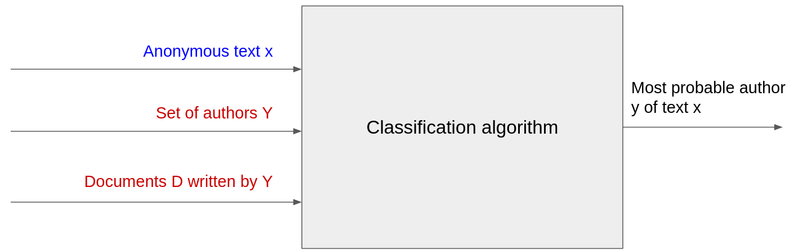

# ATI: multiclass single-label Authorship aTtrIbution

Ati is a web-based application for predicting which famous classic Bulgarian novelist wrote a piece of text (short or long).

## Formal Aim

Given a corpus of documents `D`, each one written by one author `y`, identify the author of an anonymous text `x`.

## Plan of attack

### Sprint 01

- [X] Create proper GitHub repository.
- [X] Upload structure for documentation.
- [X] Scrape [chitanka.info](https://chitanka.info/).
  - [X] Use dataclasses to create dictionaries.
- [X] Combine in a big dataset.
- [X] Filter only texts used for modelling.

### Sprint 02

- [X] Download texts.
- [X] Combine them in a dataframe.
- [X] Simple preprocessing:
  - [X] Remove suffix from each text (holds metainformation).
  - [X] Remove prefix from each text (holds metainformation).
- [X] Organize notebooks: split the first one into two.
- [X] Preprocessing: Lemmatize, Stem, Bigrams, Trigrams, Fourgrams.
- [X] Word embedding: tf-idf.
- [X] Perform EDA.
- [X] Create samples (parts of random texts) instead of using the whole texts as such.
- [X] Modelling:
  - [X] Train/val/test split.
  - [X] PCA so as to not overfit.
- [X] Evaluating on val split:
  - [X] f1.
  - [X] mcc.
  - [X] Log loss.
- [X] Evaluating on test split. This should be done only 1 time!
  - [X] f1.
  - [X] mcc.
  - [X] Log loss.
- [X] Pickle model.
- [X] Create the user interface using [streamlit](https://streamlit.io/).

### Sprint 03

- [X] Explore `Catboost`.
- [X] Try to create a pipeline object.
- [X] PyCaret with PCA.
- [X] PyCaret without PCA. Results seem to be (almost) the same.
- [X] Implement as much metrics as possible:
  - [X] Install bulgarian-nlp POS tagger. Couldn't make it work. Used [classla](https://pypi.org/project/classla/) Python package.
  - [X] Character-based lexical features;
  - [X] Sentence- and word-based features;
  - [X] Function / Stop words;
  - [X] Flesch Reading Ease Score.
- [X] Modelling.
- [X] Word cloud;

### Sprint 04

- [X] EDA on the text features.
- [ ] Pipeline for the text features models.
- [ ] Show text features in streamlit.
- [ ] Try using transformer embeddings using `sbert`.
  - [ ] Combinations.
  - [ ] Compare `LogisticRegression`, `KNeighborsClassifier`, `GaussianNB`, `MultinomialNB`, `DecisionTree`, `RandomForest`, `XGBoost`, and `combined/aggregated`.
- [ ] Finish documentation
- [ ] Fix links in last section of documentation.

### Future improvements

- [ ] Remove multicolinearity.
- [ ] Better modelling.
- [ ] More EDA.

## Motivation / Use cases

1. **Authorship check**: Is the given text really written by a certain author?
2. **Plagiarism detection**: Finding similarities between two texts.
3. **Author profiling or introduction**: Extracting information about the age, education, gender, etc. of the author of a given text.
4. **Detecting stylistic inconsistencies** (as can happen in collaborative writing): Is there only one author?

## Set of authors Y and set of documents D

- **Ivan Vazov**: "Българският език", "Отечество любезно", "При Рилския манастир", "Елате ни вижте", "Линее нашто поколение", "Левски", "Паисий", "Кочо", "Опълченците на Шипка", "Дядо Йоцо гледа", "Чичовци", "Под игото";
- **Aleko Konstantinov**: "Разни хора, разни идеали", "Бай Ганьо";
- **Elin Pelin**: "Ветрената мелница", "Косачи", "Задушница", "Мечтатели", "На оня свят", "Андрешко", "Чорба от греховете на отец Никодим", "Занемелите камбани", "Гераците";
- **Jordan Jovkov**: "Песента на колелетата", "Последна радост", "Шибил", "През чумавото", "Индже", "Албена", "Другоселец", "Серафим";
- **Dimitar Dimov**: "Тютюн";
- **Dimitar Talev**: "Железният светилник".

## Metrics used

The goal is to include as much as possible (the more the better, right?). They were taken from [here](https://ceur-ws.org/Vol-2936/paper-191.pdf).

- **Character-based lexical features**: The number of distinct special character, spaces, punctuation, parentheses and quotation marks as separate features.
- **Sentence- and word-based features**: Distribution of POS-tags, token length, number of sentences, sentence length, average word length, words in all-caps and counts of words above and below 2-3 and 6 characters as separate features. For those statistics a possible package to use is [spacy](https://spacy.io/).
- **Function / Stop words**: The frequency of each function word.
- Various types of **Reading Ease Scores**: indicate the understandability of a passage with a number. It shows how difficult it is to understand the content.

## Approach with modelling

Goal is to try four types of models:

1. By using *tf-idf* create a big matrix with word embeddings. Use it to predict the author.
2. By using an encoding from a transformer - [sbert](https://www.sbert.net/), to get the word embeddings.
3. Using only the metrics.
4. Making a combination of the above approaches: for example, concatenating the encodings from 2 with the metrics 3.

Parallel to the above or after it experiments should be done to determine the best type of classifier: **one** or **an ensamble**.

## Resources

### Where can the texts be found?

- <https://chitanka.info/>

### Scrapy YouTube tutorials

- [Best Web Scraping Combo?? Use These In Your Projects - John Watson Rooney](https://www.youtube.com/watch?v=HpRsfpPuUzE)
- [Intro To Web Crawlers & Scraping With Scrapy - Traversy Media](https://www.youtube.com/watch?v=ALizgnSFTwQ)

### POS Tagger for Bulgarian

- [classla](https://pypi.org/project/classla/)
- [bulgarian-nlp](https://github.com/AMontgomerie/bulgarian-nlp) <- Did not work for me.

### Papers on the topic

- [Multi-label Style Change Detection by Solving a Binary Classification Problem](https://ceur-ws.org/Vol-2936/paper-191.pdf)
- [Authorship attribution](https://link.springer.com/article/10.1007/BF01830689)
- [Automatic Authorship Attribution](http://portal.acm.org/citation.cfm?doid=977035.977057)
- [Quantitative Authorship Attribution: An Evaluation of Techniques](https://lirias.kuleuven.be/bitstream/123456789/331335/1/Grieve%20-%20authorship%20attribution.pdf)
- [A Survey of Modern Authorship Attribution Methods](https://onlinelibrary.wiley.com/doi/10.1002/asi.21001)
- [Efficient Estimation of Word Representations in Vector Space](https://arxiv.org/pdf/1301.3781.pdf)
- [Distributed Representations of Sentences and Documents](https://cs.stanford.edu/~quocle/paragraph_vector.pdf)
- [CAG: Stylometric Authorship Attribution of Multi-Author Documents Using a Co-Authorship Graph](https://ieeexplore.ieee.org/stamp/stamp.jsp?tp=&arnumber=8962080)
- [Style Change Detection on Real-World Data using an LSTM-powered Attribution Algorithm](https://ceur-ws.org/Vol-2936/paper-163.pdf)
